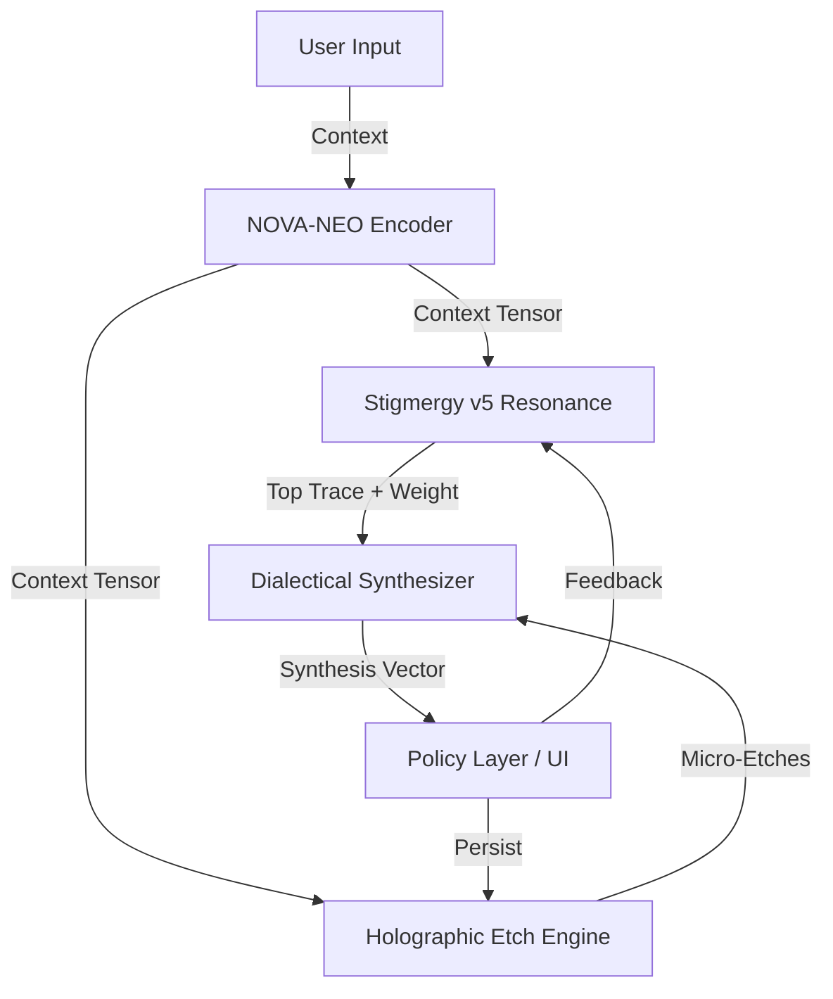
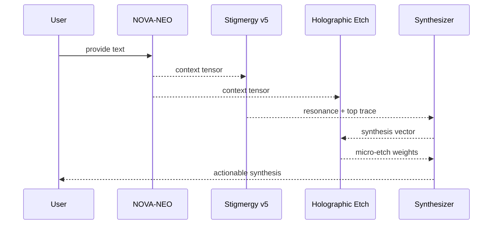

# MCOP Framework 2.0 Architecture

## Overview
MCOP Framework 2.0 operationalizes the NOVA-NEO, Stigmergy v5, and Holographic Etch triad as composable services. The system favors deterministic transforms, provenance tracking, and low-latency feedback across UI, API, and edge deployments.

## Component Stack



- **NOVA-NEO Encoder**: Deterministic context tensor generator with optional normalization and entropy reporting.
- **Stigmergy v5**: Vector pheromone store with Merkle-style provenance, resonance scoring, and decay-resistant weighting.
- **Holographic Etch**: Rank-1 micro-etch accumulator that persistently tracks weight deltas for confidence calibration.
- **Dialectical Synthesizer**: Combines thesis (context) and antithesis (trace) into a synthesis vector used by interfaces and agents.

## Data Structures
- **Context Tensor**: Fixed-dimension numeric vector (default: 64 in code seeds) derived from input text via SHA-256 expansion.
- **Pheromone Trace**: `{ id, hash, parentHash, context, synthesisVector, weight, metadata, timestamp }` stored in-memory with hooks for durable stores.
- **Etch Record**: `{ hash, deltaWeight, note, timestamp }` capturing rank-1 updates for auditing and replay.

## Flows

### Resonance Flow
1. Encode user input into a context tensor.
2. Compute cosine resonance against stored pheromone traces.
3. Return the highest scoring trace and confidence weighting.
4. Emit a new trace if confidence exceeds threshold.

### Etch Flow
1. Combine context tensor and synthesis vector into a rank-1 update signal.
2. Persist the delta weight and provenance hash.
3. Expose recent etches for visualization and replay.

### Dialectical Synthesis Flow



## Directory Layout (proposed)

```text
src/
  core/
    novaNeoEncoder.ts      # Context encoding utilities
    stigmergyV5.ts         # Pheromone storage and resonance scoring
    holographicEtch.ts     # Rank-1 etch accumulator
    types.ts               # Shared triad types and helpers
  app/                     # Next.js UI
  __tests__/               # Jest test suite
config/
  examples/
    mcop.config.example.json  # Tunable parameters for triad seeds
```

## Extensibility Hooks
- **Storage adapters**: Swap in Redis, DynamoDB, or S3-backed append-only logs for traces and etches.
- **Hardware acceleration**: Offload rank-1 updates to GPU/FPGA using BLAS-compatible kernels; retain Node bindings.
- **Observability**: Emit OpenTelemetry spans around encoding, resonance, and etch persistence.

## Security Considerations
- Inputs are treated as untrusted; deterministic hashing avoids executing user-provided code.
- Provenance hashes provide tamper-evident audit trails for traces and etches.
- Config-driven thresholds prevent unbounded memory growth.
