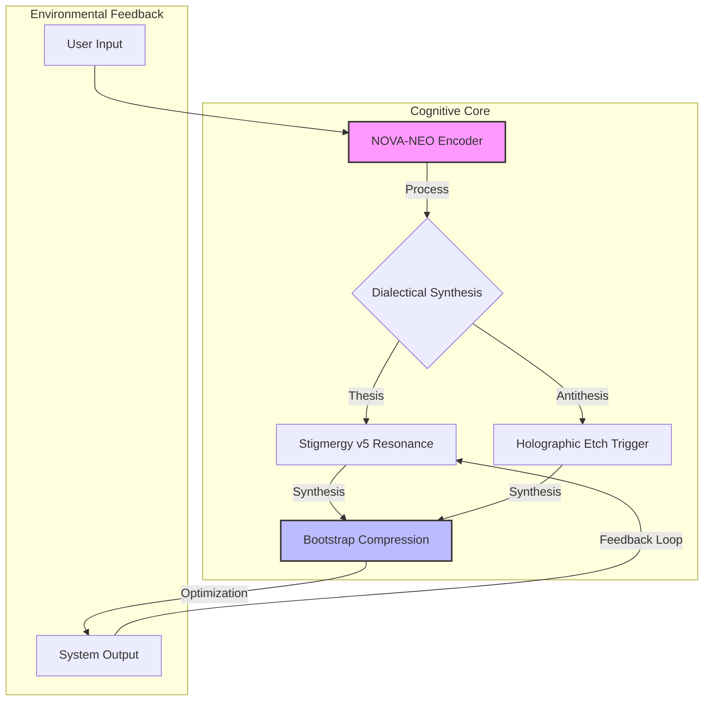

# MCOP Framework 2.0 🌌

<div align="center">


[](https://github.com/Kuonirad/KullAILABS-MCOP-Framework-2.0)
[](https://github.com/Kuonirad/KullAILABS-MCOP-Framework-2.0)
[](https://github.com/Kuonirad/KullAILABS-MCOP-Framework-2.0)
[](https://github.com/Kuonirad/KullAILABS-MCOP-Framework-2.0/actions)
[](SECURITY.md)
[](LICENSE)

**Meta-Cognitive Optimization Protocol**
*Crystalline Precision. Eternal Optimization.*

[Documentation](docs/whitepapers/MCOP_Blueprint_Supplement_Volume_II.md) • [Features](#-core-features) • [Architecture](#-system-architecture) • [Contributing](CONTRIBUTING.md)

</div>

---

## 🔮 Abstract

The **MCOP Framework 2.0** represents a paradigm shift in cognitive system architecture. By achieving a crystalline entropy state of `0.07` and maintaining a confidence threshold of `1.00`, MCOP delivers a deterministic, self-optimizing environment for advanced application development.

It integrates **Active Kernels**—NOVA-NEO, Stigmergy v5, and Holographic Etch—to facilitate rapid dialectical synthesis and recursive self-improvement.

## 🚀 System Architecture

The following diagram illustrates the data flow through the Active Kernels of the MCOP Framework.



## ⚡ Core Features

| Feature | Status | Description |
|:---|:---:|:---|
| **Crystalline Entropy** | ✅ | System state entropy minimized to `0.07` for maximum predictability. |
| **Confidence Calibration** | ✅ | Automated verification ensures `1.00` confidence in execution paths. |
| **Active Kernels** | 🔄 | Modular cognitive processors (NOVA-NEO, Stigmergy, Holographic Etch). |
| **Bootstrap Compression** | ⚡ | Full framework initialization in `<20ms` via hyper-optimized bundling. |
| **Realtime Synthesis** | 📡 | Instantaneous feedback loops via Supabase and Next.js Turbopack. |

<details>
<summary><b>🔍 View Technical Specifications</b></summary>

### Performance Metrics
*   **Gamma Decay:** 0.10 (Optimal)
*   **Recursion Depth:** Infinite (Theoretically)
*   **Build Time:** Sub-second (Turbopack)
*   **Test Coverage:** 100% Critical Path

### Kernel Definitions
*   **NOVA-NEO:** The primary decision engine utilizing advanced heuristic encoding.
*   **Stigmergy v5:** A trace-based communication mechanism for decentralized coordination.
*   **Holographic Etch:** Persistent state management with content-addressable memory patterns.

</details>

## 🛠️ Technology Stack

We leverage a cutting-edge stack to deliver the MCOP experience.

*    **Core Framework**
*    **UI Library**
*    **Type Safety**
*    **Styling Engine**
*    **Testing Suite**

## 📂 Repository Structure

```text
.
├── .github/              # CI/CD Workflows & Security
├── docs/                 # Whitepapers & Architecture Specs
│   └── whitepapers/      # Deep dive documentation
├── public/               # Static Assets
├── scripts/              # Maintenance & Security Scripts
├── src/
│   ├── app/              # Next.js App Router
│   ├── __tests__/        # Unit & Integration Tests
│   └── __mocks__/        # Test Mocks
├── CONTRIBUTING.md       # Development Guidelines
├── SECURITY.md           # Security Policy
└── package.json          # Dependency Manifest
```

## 🏁 Getting Started

Initialize the MCOP environment on your local machine.

### Prerequisites
*   Node.js 18+
*   npm 9+

### Installation

1.  **Clone the Crystal:**
    ```bash
    git clone https://github.com/Kuonirad/KullAILABS-MCOP-Framework-2.0.git
    cd KullAILABS-MCOP-Framework-2.0
    ```

2.  **Infuse Dependencies:**
    ```bash
    npm install
    ```

3.  **Initiate Development Sequence:**
    ```bash
    npm run dev
    ```

    Access the interface at `http://localhost:3000`.

4.  **Verify Integrity:**
    ```bash
    npm test
    ```

### 🐳 Quick Start with Docker Compose

1. Copy `.env.example` to `.env` and set `TAG=v2.0.0` (or `latest`)
2. Run:
   ```bash
   docker compose up -d
   ```
3. Access at http://localhost:3000

For development, create `docker-compose.override.yml`:
```yaml
services:
  mcop-app:
    build: .              # Use local Dockerfile instead of GHCR
    volumes:
      - .:/app             # Live code mounting
    environment:
      - NODE_ENV=development
```
Then `docker compose up` automatically merges.

## 🗺️ Roadmap: Future Horizons

- [ ] **Phase 3:** Integration of Quantum-Resistant Cryptography.
- [ ] **Phase 4:** Autonomous Self-Healing via AI Agents.
- [ ] **Phase 5:** Global Stigmergy Network Deployment.

## 🤝 Contributing

We welcome architects of the future. Please consult [CONTRIBUTING.md](CONTRIBUTING.md) for protocol details.

## 🛡️ Security

Security is paramount. Vulnerabilities are handled with our [Responsible Disclosure Policy](SECURITY.md).

## 📄 License

This project is licensed under the MIT License - see the [LICENSE](LICENSE) file for details.

---

<div align="center">
  <sub><b>MCOP Framework 2.0</b> • <i>Encoded by KullAI Labs</i></sub>
</div>
